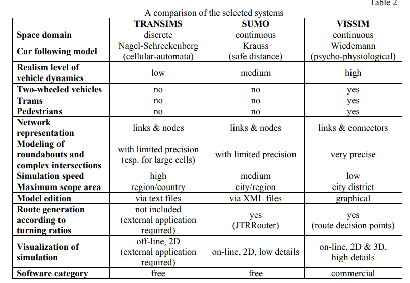
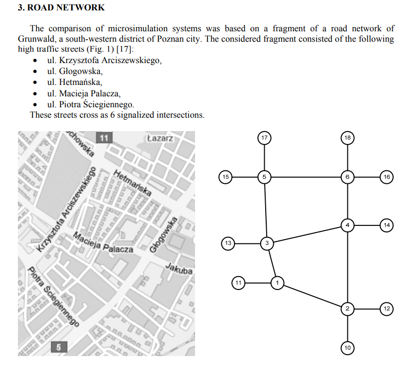
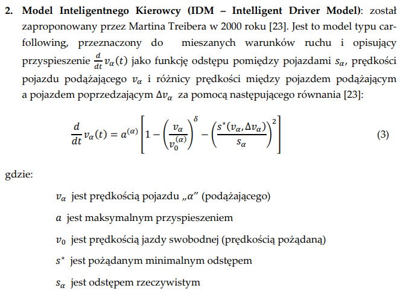

# Materiały i źródła dotyczące dziedziny problemu

---

1. [A COMPARISON OF MICROSCOPIC TRAFFIC FLOW SIMULATION
   SYSTEMS FOR AN URBAN AREA](https://yadda.icm.edu.pl/baztech/element/bwmeta1.element.baztech-article-BSL3-0024-0061/c/Maciejewski.pdf) - porównanie wyników zastosowania systemów TRANSIMS, SUMO i VISSIM do mikroskopowej symulacji przepływu ruchu dla fragmentu sieci dróg miejskich

- podział modelu ruchu drogowego na kategorie (makro, mikro, mezo, submikro)
- opis mikroskopowych symulatorów
   - a to co nas interesuje:
  SUMO (Simulation for Urban MObility) - to darmowy mikroskopijny system symulacji przepływu ruchu opracowany przez Niemieckie Centrum Lotnictwa i Kosmonautyki (DLR). Obejmuje on model Kraussa - model bezpiecznej odległości samochodu podążającego, rozszerzenie modelu Gippsa [10] oraz model zmiany pasa ruchu Krajzewicza.
  W przeciwieństwie do symulacji opartej na dyskretnym czasowo-przestrzennym CA, SUMO obsługuje podejście dyskretne
  czasowo-przestrzenne. System umożliwia symulację dla różnych typów pojazdów, różnych skrzyżowań z sygnalizacją świetlną lub bez niej, dla sieci z liczbą połączeń przekraczającą 10 000. Ponadto, SUMO obejmuje procedury dynamicznego przydzielania ruchu zaproponowane przez Gawrona oraz graficzną aplikację, która zapewnia dwuwymiarową wizualizację graficzną symulacji ruchu
- przedstawienie sieci dróg jako grafu:
  
- opis świateł, sieci drogowej, generowania ruchu, opis warunków pogodowych, natężenia drogowego, godzin pomiarów
- oznaczenia: P – samochód osobowy, L – samochód ciężarowy, H – samochód ciężarowy, H – samochód ciężarowy z przyczepą, C – autobus/autokar, M – motocykl i B – rower oraz manewru (L – skręt w lewo, S – jazda na wprost i R – skręt w prawo)
- rola kalibracji modelu
- problem z SUMO: niewystarczająca przepustowość sieci - szczególnie skrzyżowań, sieć nie była w stanie obsłużyć ruchu o 100% objętości,
  w wersji SUMO 0.11.1 nie da się kalibrować uwzględniając niektóre parametry jak zmianę pasa ruchu, koniec końców udało się skalibrować i uzyskano wartości, które gwarantowały brak zatorów nawet przy 100% natężeniu, aczkolwiek nawet niewielkie zmiany drastycznie pogarszały przepustowość sieci. Kolejny wniosek: nie dało się przeprowadzić symulacji na żadnym zestawie dla zwiększonego natężenia ruchu bez zwiększania zatorów a wartości zaproponowane przez Kraussa i domyślnie stosowane w SUMO zdecydowanie różnią się od wyznaczonych parametrów

---

2. [Adaptacyjny system sterowania ruchem drogowym](https://mostwiedzy.pl/pl/publication/download/1/adaptacyjny-system-sterowania-ruchem-drogowym_93939.pdf) - obszerna praca doktorska, można poczytać o:

- modelowanie ruchu drogowego (str.19-40): matematyczne modele zachowań kierowców, czyli jak można wyliczać przyspieszenia kierowców, coś o modelach bezpiecznej odległości (proporcjonalna do prędkości pojazdu poprzedzającefo i prędkości pojazdu podążającego), modele zmiany pasa ruchu - sygnalizacja, szukanie luki, modele hamowania awaryjnego, wyprzedzania i skręcania
- Modele mikroskopowe zajmują się analizą ruchu drogowego na bardzo
  szczegółowym poziomie, biorąc pod uwagę indywidualne pojazdy i ich
  kierowców. Wymagają dokładnych danych o każdym pojeździe na drodze, takich jak położenie, prędkość, przyspieszenie, preferencje kierowcy np.
  
- Model Kraussa opisuje zachowanie kierowców na podstawie ich reakcji na
  odległość do pojazdu przed nimi, prędkość pojazdu przed nimi i przyspieszenie.
  Model ten uwzględnia różne style jazdy kierowców i asymetrię reakcji na
  przyspieszanie i hamowanie.

---

3. [Modelowanie i symulacja zużycia paliwa
   i emisji spalin w ruchu miejskim
   ](https://min.wmi.amu.edu.pl/wp-content/uploads/2015/01/Praca_magisterska_informatyka.pdf)

- symulator SUMO - od str.32, opis modelu Kraussa
- schemat przygotowania symulacji z wykorzystaniem SUMO(str. 34):
  1. Przygotowanie sieci drogowej
  2. Przygotowanie definicji podróży
  3. Obliczenie tras przejazdu
  4. Symulacja
  5. Analiza
- walidacja wyników, określenie jakości (str.65)

---

4. [Fundamentals of Traffic
   Simulation](http://ndl.ethernet.edu.et/bitstream/123456789/22122/1/331.pdf)

- Models, Traffic Models, Simulation, and Traffic Simulation (strona 1-63)
- Traffic Simulation with SUMO – Simulation of Urban Mobility (strona 269-295)

---

5. [Edytor sieci drogowej na potrzeby symulacji ruchu autonomicznego](https://www.mechanik.media.pl/pliki/do_pobrania/artykuly/23/2024_11_s0034.pdf) - tutaj problematyka tworzenia sieci drogowych na potrzeby symulacji ruchu autonomicznego

- co nie wspiera SUMO

  - dokładne odwzorowanie geometrii sieci drogowej za ą krzywych (niedopuszczalne jest użycie linii wiementowej)
  - symulacja ruchu kolumny pojazdów (na potrzebysymrów pojazdów uprzywilejowanych)
  - sterowanie ruchem na skrzyżowaniu przez policjanta
  - symulacja i sterowanie ruchem autonomicznym w czasie rzeczywistym
  - symulacja korytarza życia w reakcji na pojawienie się pojazdu uprzywilejowanego.

- SUMO i OSM (OpenStreetMap)
  - SUMO pozwala na wykorzystanie danych OSM (OpenStreetMap) do wygenerowania danych o ścieżkach ruchu, znakach i sygnalizacji świetlnej. Niestety dane OSM są tworzone przez szeroką społeczność, w związku z czym są podatne na błędy
  - w danych OSM często brakuje informacji o rzeczywistej geometrii danego fragmentu drogi
  - działa w uporszczony sposób; ciężko jest wygenerować złożone skrzyżowania w sposób automatyczny

---

Dodatkowe linki:

- [SUMO](https://eclipse.dev/sumo/)
- [OSM](https://www.openstreetmap.org/#map=17/50.072250/20.037531)
